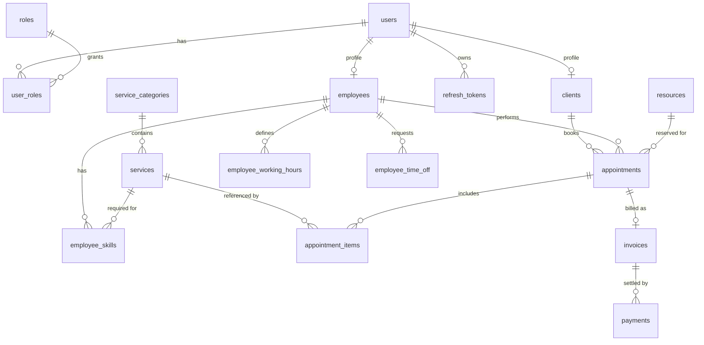

# ServiceDesk

Backend for a generic services business (bookings, staff scheduling, dynamic pricing, invoicing).
Built as a portfolio project to demonstrate production-grade Spring Boot: layered architecture,
JWT security with role-based access, non-trivial domain logic, RFC 7807 error handling, and a
test suite that runs against a real PostgreSQL instance.

> Status: work in progress. The domain is delivered module by module — see the checklist below.

## Build status

| Module | State |
|---|---|
| `identity` — accounts, JWT auth, refresh-token rotation, RBAC | done |
| `common` — RFC 7807 error handling, auditing, OpenAPI | done |
| `clients` — client profiles | scaffolded |
| `catalog` — service categories & offerings, ADMIN-managed | done |
| `resources` — bookable resources (rooms / stations / …) | done |
| `staff` — employees, working hours, time off | planned |
| `scheduling` — appointments, availability, overlap protection | planned |
| `pricing` — loyalty tiers, time-based rules, quote calculation | planned |
| `billing` — invoices, payments | planned |

## Tech stack

- Java 21, Spring Boot 3.3
- Spring Web, Spring Data JPA, Spring Security (stateless JWT)
- PostgreSQL 16, Flyway migrations
- MapStruct, Lombok (used sparingly — never `@Data` on entities)
- JUnit 5, Mockito, AssertJ, Testcontainers
- Docker / Docker Compose
- springdoc-openapi (Swagger UI at `/swagger-ui.html`)

## Architecture

Package-by-feature; each feature keeps its own layers:

```
web  ->  service  ->  repository  ->  domain
 |          |
 DTOs    commands / results (records)
```

- Controllers are thin: validation, mapping, delegation.
- Business rules and transaction boundaries live in services.
- Domain entities carry behaviour (state transitions, invariants), not just fields.
- Cross-cutting concerns (error handling, auditing, security) sit in `common` and `identity`.

### Error handling

Every error response is an [RFC 7807](https://www.rfc-editor.org/rfc/rfc7807) `application/problem+json`
document produced by a single `@RestControllerAdvice`. Domain exceptions extend `ApplicationException`
and carry their own HTTP status and problem type; validation failures are returned with a structured
`errors` array.

### Authentication

- `POST /api/v1/auth/register` creates a `CLIENT` account and profile.
- `POST /api/v1/auth/login` returns a short-lived access token (JWT, HS256) and an opaque refresh token.
- Refresh tokens are stored **hashed**, single-use, and rotated on every `POST /api/v1/auth/refresh`.
  Re-using an already-rotated token revokes the whole token family (reuse-detection).
- `POST /api/v1/auth/logout` revokes the presented refresh token.

## Data model



Concurrency strategy for bookings (planned, `scheduling` module):

1. Pessimistic lock (`SELECT ... FOR UPDATE`) on the employee / resource row during the booking
   critical section.
2. PostgreSQL `EXCLUDE USING gist` constraint on `appointments` as a safety net — overlapping
   time ranges for the same employee or resource are rejected at the database level.
3. Optimistic locking (`@Version`) for reschedule / status-change / payment flows.

## Running the app

### With Docker Compose

```bash
cp .env.example .env          # adjust the JWT secret
docker compose up --build
```

API on `http://localhost:8080`, Swagger UI on `http://localhost:8080/swagger-ui.html`.

### Locally against a database

```bash
docker compose up -d db
./mvnw spring-boot:run -Dspring-boot.run.profiles=dev
```

## Build and test

```bash
./mvnw verify
```

Unit tests (service layer, Mockito + AssertJ) run everywhere. Integration tests
(`@SpringBootTest` + MockMvc + Testcontainers PostgreSQL) run only when a Docker daemon is
available and are skipped otherwise.

## Example flow

```bash
# register
curl -s localhost:8080/api/v1/auth/register -H 'Content-Type: application/json' -d '{
  "email": "ada@example.com", "password": "Sup3rSecret",
  "firstName": "Ada", "lastName": "Kowalska", "marketingConsent": true
}'

# login
TOKENS=$(curl -s localhost:8080/api/v1/auth/login -H 'Content-Type: application/json' -d '{
  "email": "ada@example.com", "password": "Sup3rSecret"
}')
ACCESS=$(echo "$TOKENS" | jq -r .accessToken)

# call a protected endpoint
curl -s localhost:8080/api/v1/me -H "Authorization: Bearer $ACCESS"
```
