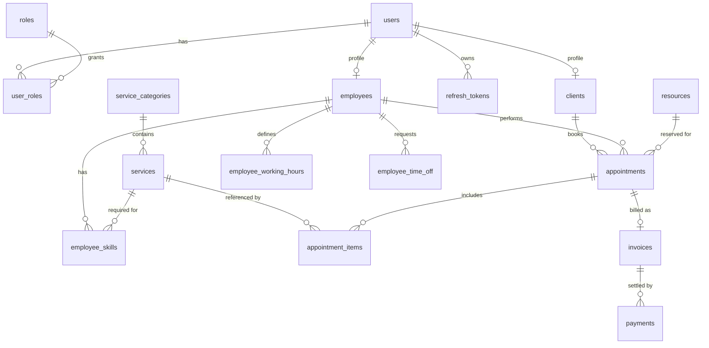

# ServiceDesk

[](https://github.com/oziiqx/servicedesk-backend/actions/workflows/ci.yml)

Backend for a generic services business — clients book time with a specialist, staff manage
their schedules, prices are computed from loyalty and time-based rules, and completed
appointments are invoiced.

Built to show production-grade Spring Boot: a modular layered architecture, stateless JWT
security with role-based access, non-trivial domain logic (calendar overlap protection,
dynamic pricing, an invoice state machine), RFC 7807 error handling, and a test suite that runs
against a real PostgreSQL database via Testcontainers.

A small React SPA that drives this API lives in
[`servicedesk-frontend`](https://github.com/oziiqx/servicedesk-frontend).

## Modules

| Module | Responsibility |
|---|---|
| `common` | RFC 7807 error handling, auditable entities, OpenAPI, injectable `Clock` |
| `identity` | accounts, roles, stateless JWT, rotating refresh tokens, admin bootstrap |
| `clients` | client profile and loyalty snapshot (`GET /api/v1/clients/me`) |
| `catalog` | service categories and offerings, ADMIN-managed |
| `resources` | bookable resources (rooms / stations / bays …) |
| `staff` | employees, weekly working hours, time off, skill assignment |
| `scheduling` | appointments, availability search, three-layer overlap protection |
| `pricing` | loyalty tiers, time-based surcharge/discount rules, the quote calculator |
| `billing` | invoices issued on completion (via a domain event), payments |

## Tech stack

Java 21 · Spring Boot 3.3 · Spring Web / Data JPA / Security · PostgreSQL 16 · Flyway ·
MapStruct · Lombok (sparingly — never `@Data` on entities) · JUnit 5 · Mockito · AssertJ ·
Testcontainers · Docker Compose · springdoc-openapi (Swagger UI at `/swagger-ui.html`).

## Architecture

Package-by-feature; each feature keeps its own layers:

```
web  ->  service  ->  repository  ->  domain
 |          |
 DTOs    commands / results (records)
```

- Controllers are thin: validate, map, delegate.
- Business rules and transaction boundaries live in services.
- Domain entities carry behaviour (state machines, invariants), not just fields.
- Modules depend downwards only; `scheduling` never imports `billing` — completion is a domain
  event.

### Error handling

Every error is an [RFC 7807](https://www.rfc-editor.org/rfc/rfc7807) `application/problem+json`
document from a single `@RestControllerAdvice`. Domain exceptions extend `ApplicationException`
and carry their own status and `type`; validation failures include a structured `errors` array.

### Authentication

- `POST /api/v1/auth/register` creates a `CLIENT` account and profile.
- `POST /api/v1/auth/login` returns a short-lived HS256 access token and an opaque refresh token.
- Refresh tokens are stored **hashed**, single-use, and rotated on every `POST /api/v1/auth/refresh`;
  replaying a rotated token revokes the whole token family.
- `AdminBootstrap` creates one `ADMIN` account on first start (`servicedesk.bootstrap.*`) — it is
  the only way to get an admin, and it logs a warning while the default password is in use.

### Scheduling — overlap protection

1. Pessimistic lock (`SELECT … FOR UPDATE`) on the employee and resource rows during the booking
   critical section, so concurrent bookings for the same provider serialize and the loser gets a
   friendly `409`.
2. A PostgreSQL `EXCLUDE USING gist` constraint on `appointments` (needs the **`btree_gist`**
   extension) as the backstop — overlapping `tstzrange` values for the same employee or resource
   are rejected by the database and translated to `409 slot-unavailable`.
3. Optimistic locking (`@Version`) for reschedule and status changes.

`ConcurrentBookingIntegrationTest` races two threads for one slot and asserts exactly one booking.

### Pricing

```
net       = Σ(service base price × quantity)                   (snapshot on the appointment items)
surcharge = net × Σ(matching PricingRule surcharge %)          e.g. +15% on weekends
subtotal  = net + surcharge
discount% = loyalty tier % + rule discounts, capped at servicedesk.pricing.max-total-discount-percentage
total     = subtotal − subtotal × discount%
```

The loyalty tier comes from the client's completed-appointment count and 12-month spend
(`LoyaltyTierResolver`) and is snapshotted onto the appointment. Tiers and rules are seeded (`V7`).

### Billing

`COMPLETED` publishes `AppointmentCompleted`; `billing` handles it in the same transaction and
issues an invoice (`net` = appointment total + `servicedesk.billing.invoice-tax-rate` VAT, number
from a DB sequence `INV-<year>-<seq>`). An invoice flips to `PAID` once payments cover the gross.

## Data model



`loyalty_tiers` and `pricing_rules` are standalone configuration tables — the resolved tier
name and adjustment amounts are snapshotted onto each `appointment`, not linked by a foreign key.

## Running the app

### Docker Compose

```bash
cp .env.example .env      # set a real JWT secret and admin password
docker compose up --build
```

API on `http://localhost:8080`, Swagger UI on `http://localhost:8080/swagger-ui.html`.

### Locally against a database

```bash
docker compose up -d db
./mvnw spring-boot:run -Dspring-boot.run.profiles=dev

# add the `demo` profile to seed sample services, resources, 2 employees and a client
./mvnw spring-boot:run -Dspring-boot.run.profiles=dev,demo
```

If port 5432 is already taken by a local PostgreSQL, publish the container elsewhere and point
the app at it: `POSTGRES_PORT=5544 docker compose up -d db` then
`SERVICEDESK_DB_URL=jdbc:postgresql://localhost:5544/servicedesk ./mvnw spring-boot:run -Dspring-boot.run.profiles=dev,demo`.

With the `demo` profile every seeded account uses the password `Sup3rSecret`
(`olga@servicedesk.local`, `piotr@servicedesk.local`, `client@servicedesk.local`); the admin is
`admin@servicedesk.local` / `ChangeMe!123` unless overridden.

> **Production note:** the database user must be able to `CREATE EXTENSION btree_gist`, or the
> extension must be pre-installed — migration `V6` needs it for the overlap constraint.

## Build and test

```bash
./mvnw verify
```

Unit tests (service layer, Mockito + AssertJ) run everywhere. Integration tests
(`@SpringBootTest` + MockMvc + Testcontainers) run when a Docker daemon is available and are
skipped otherwise. CI runs the full suite on every push.

## API reference

| Method & path | Role | Purpose |
|---|---|---|
| `POST /api/v1/auth/register` \| `login` \| `refresh` \| `logout` | public | account lifecycle |
| `GET /api/v1/me` | any | current principal |
| `GET /api/v1/clients/me` | CLIENT | profile, live loyalty tier, history totals |
| `GET /api/v1/services` \| `/services/{code}` \| `/service-categories` | any | browse the catalog |
| `POST/PUT /api/v1/admin/service-categories` · `POST/PUT /api/v1/admin/services` · `POST /api/v1/admin/services/{code}/activation` | ADMIN | manage the catalog |
| `GET /api/v1/resources` \| `/resources/{id}` | EMPLOYEE, ADMIN | list resources |
| `POST/PUT /api/v1/admin/resources` · `POST /api/v1/admin/resources/{id}/activation` | ADMIN | manage resources |
| `POST /api/v1/admin/employees` · `GET` \| `GET/PUT /{id}` · `POST /{id}/employment-status` · `GET/PUT /{id}/skills` | ADMIN | manage staff |
| `GET /api/v1/employees` \| `/{id}/skills` | any | staff directory |
| `GET/PUT /api/v1/employees/me/working-hours` · `GET/POST /api/v1/employees/me/time-off` · `DELETE …/{id}` | EMPLOYEE | own schedule |
| `GET /api/v1/availability?employeeId&serviceCode&date` | any | open slots |
| `POST /api/v1/appointments` | CLIENT | book |
| `GET /api/v1/appointments` \| `/{id}` | role-scoped | own / assigned / all |
| `POST /api/v1/appointments/{id}/reschedule` \| `/cancel` | CLIENT (own), ADMIN | change or drop |
| `POST /api/v1/appointments/{id}/transition?status=` | EMPLOYEE (assigned), ADMIN | lifecycle |
| `GET /api/v1/loyalty-tiers` | any | the tier ladder |
| `GET/POST/PUT /api/v1/admin/loyalty-tiers` · `GET/POST/PUT /api/v1/admin/pricing-rules` · `POST …/{id}/activation` | ADMIN | pricing config |
| `GET /api/v1/invoices` \| `/{id}` | role-scoped | own / all |
| `POST /api/v1/invoices/{id}/payments` | ADMIN | record a payment |

A ready-to-run request collection is in [`requests.http`](requests.http).

## Example flow

```bash
# 1. register and log in
curl -s localhost:8080/api/v1/auth/register -H 'Content-Type: application/json' -d '{
  "email":"ada@example.com","password":"Sup3rSecret","firstName":"Ada","lastName":"Kowalska","marketingConsent":true}'

ACCESS=$(curl -s localhost:8080/api/v1/auth/login -H 'Content-Type: application/json' \
  -d '{"email":"ada@example.com","password":"Sup3rSecret"}' | jq -r .accessToken)

# 2. find an open slot and book it (with the `demo` profile: employee 1, service DIAG-STD)
curl -s "localhost:8080/api/v1/availability?employeeId=1&serviceCode=DIAG-STD&date=2026-09-14" \
  -H "Authorization: Bearer $ACCESS"

curl -s localhost:8080/api/v1/appointments -H "Authorization: Bearer $ACCESS" \
  -H 'Content-Type: application/json' -d '{
    "employeeId":1,"services":[{"serviceCode":"DIAG-STD","quantity":1}],
    "scheduledStart":"2026-09-14T08:00:00Z"}'
```
